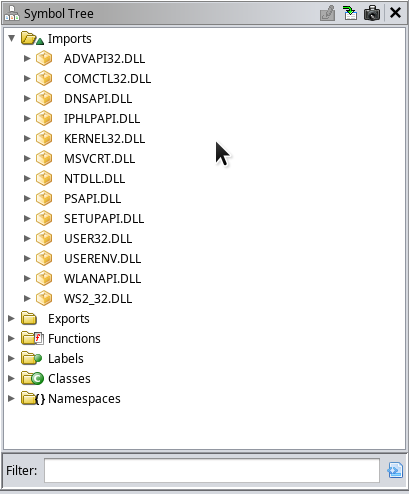
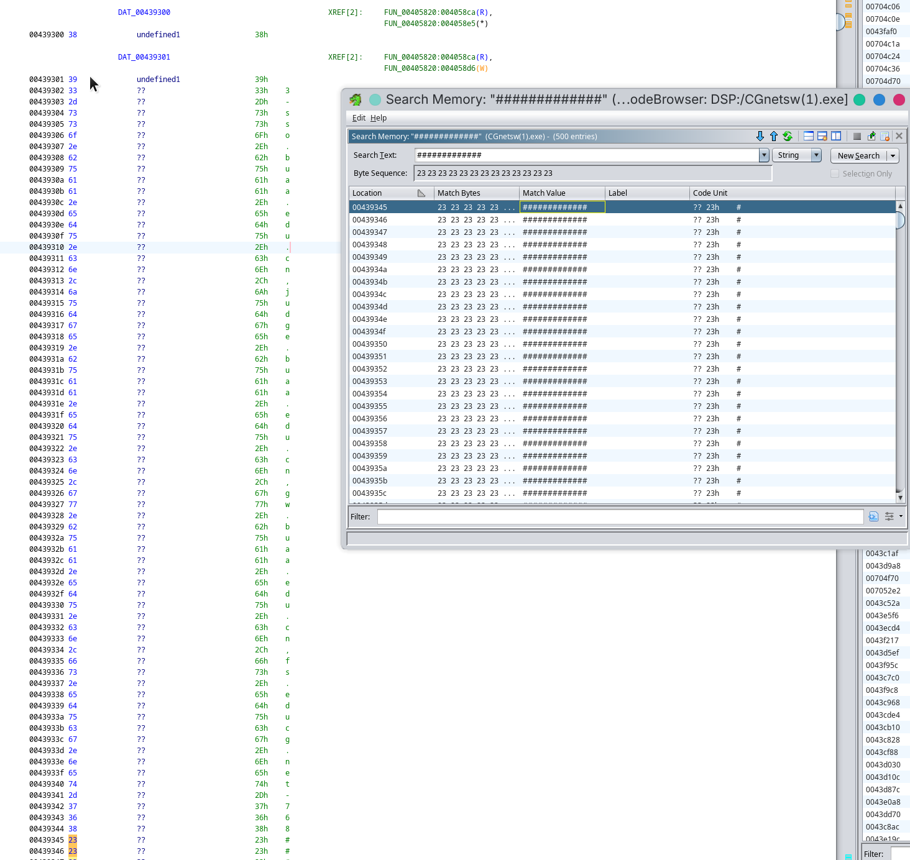
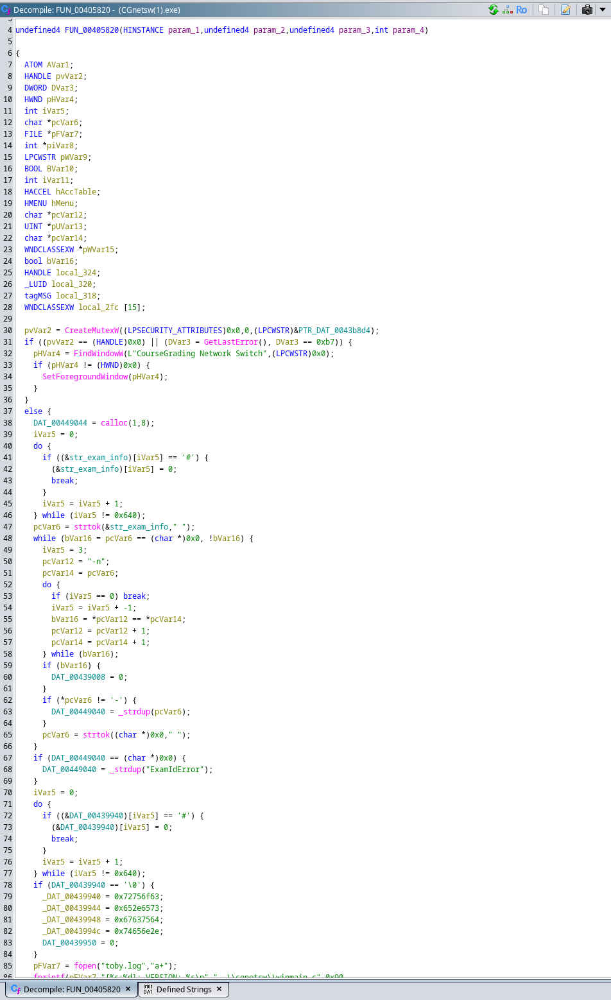
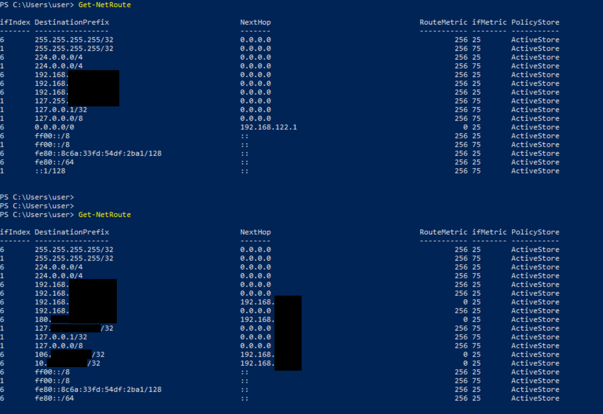
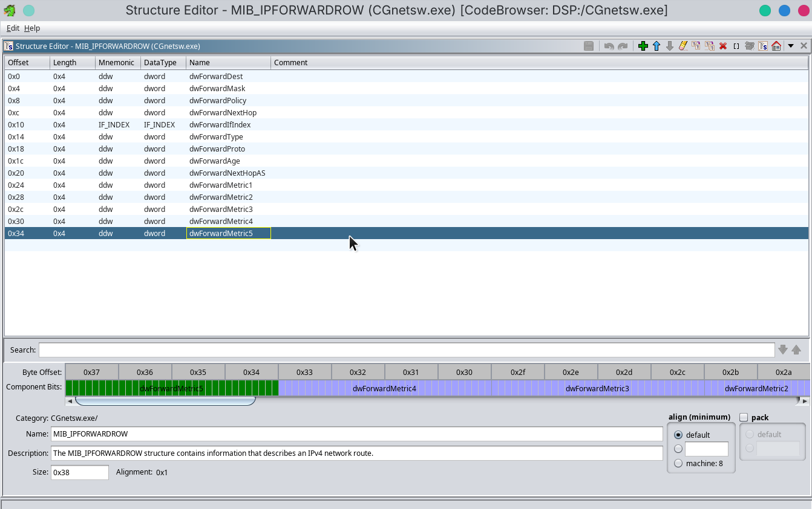
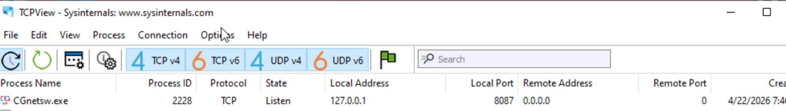
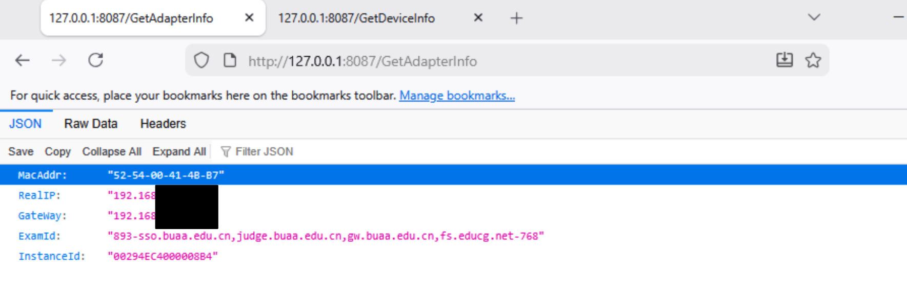
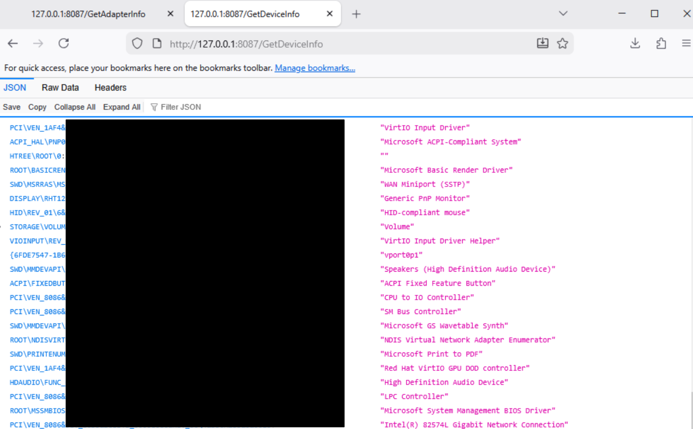
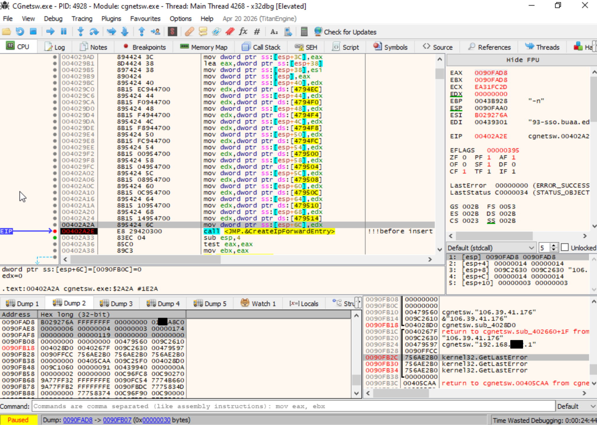

# 逆向DSP考试exe小记

DSP的考试为了让大家只能访问指定的几个域名提供了一个很小(100多k)的exe, 正好最近看了windows internal crash course(好课!), 想去分析一下这个exe的原理.

> [!NOTE]
> 其实在之前就被告诉过这个exe原理很简单, 但还是想亲自分析一下. 这篇文章的顺序不完全是我真正分析的顺序, (因为走了一些弯路)我删减和调换了一些步骤来让过程更好(也就是说这是理想中的顺序).

## PE分析

对于一个PE文件, 可以先看一下PE header和strings

```shell
computer% file CGnetsw.exe      
CGnetsw.exe: PE32 executable for MS Windows 4.00 (GUI), Intel i386 (stripped to external PDB), 9 sections

strings CGnetsw.exe |head   
!This program cannot be run in DOS mode.
.text
P`.data
.rdata
`@.eh_fram
0@.bss
.idata
.CRT
.tls
.rsrc
--snip--
```

在`strings`的输出中我们发现了这样一段有趣的信息, 看来这是允许的域名和考试的id(893).

```
893-sso.buaa.edu.cn,judge.buaa.edu.cn,gw.buaa.edu.cn,fs.educg.net-768################################################################################################
#################################################################################
##########################################################################################################################################################################################################################################################################################################################################################################################################################################################################################################################################################################################################################################################################################################################################################################################################################################################################################################################################################################################################################################################################################################################################################################################################################################################################################################################################################################################################sso.buaa.edu.cn,judge.buaa.edu.cn,gw.buaa.edu.cn,fs.educg.net###################################################################################################################################################################################################################################################################################################################################################################################################################################################################################################################################################################################################################################################################################################################################################################################################################################################################################################################################################################################################################################################################################################################################################################################################################################################################################################################################################################################################################################################################################################################################################################################################
```

继续翻找, 我们发现了以下这些信息. 看起来exe中有一个web服务, EndPoint怀疑是`/GetDeviceInfo`和`/GetAdapterInfo`.

```
127.0.0.1
HTTP/1.1 %s
Access-Control-Allow-Origin: *
Content-Type: %s;charset=utf-8
Content-Length: %d
Welcome to tinyweb
text/html
200 OK
/404
<h3>404 Page Not Found<h3>
404 Not Found
/GetAdapterInfo
application/json
/GetDeviceInfo
<p>pathinfo: %s</p><p>query stirng: %s</p>
----Tinyweb client request: ----
```

> [!NOTE]
> `strings`的输出里还找到了许多类似`[%s:%d]: Lease obtained: %ld`和`..\cgnetsw\networkswitch.c` `done_read == read_size`的字符串, 分别是日志的format-str和`assert`宏展开的调试信息.
> `C:\Users\Toby Liu\Downloads\libuv-1.x\src\uv-common.c`竟然泄漏了作者的用户名. (更值得吐槽的是源码居然在downloads里面🤫)

至此, 我们可以大胆猜测全是`#`的字符串里面硬编码了允许的域名, 而考试网页与本机通信依靠的是tinyweb的http服务(`/GetAdapterInfo` `/GetDeviceInfo`).

## Tinyweb 101

我们不妨先看看tinyweb是何方神圣. 直接在github上面搜索会找到一个[疑似pascal写的项目](https://github.com/maximmasiutin/TinyWeb), 但是如果我们搜索strings结果`Welcome to tinyweb`却没有找到.

或许不是这个项目? 但是我们找到了线索, 我们需要的其实是项目名叫tinyweb, 而且代码中硬编码了`Welcome to tinyweb`的项目, 于是我们直接zaigithub上面搜索code:`Welcome to tinyweb`, 找到了[这个项目](https://github.com/liigo/tinyweb), 这是一个C的web server实现. 翻找一下源码, 我们发现:

```c
static const char* http_respone = "HTTP/1.1 200 OK\r\n"
 "Content-Type:text/html;charset=utf-8\r\n"
 "Content-Length:18\r\n"
 "\r\n"
 "Welcome to tinyweb";
--snip--
```

```c
--snip--
snprintf(content, sizeof(content), "<p>pathinfo: %s</p><p>query stirng: %s</p>", pathinfo, query_stirng);
--snip--
```

这与strings的输出非常吻合, 应该就是这个项目了.

## 逆向工程

现在, 准备工作都已经完成了, 我们可以真正开工了.

### Ghidra, 启动

我们在Ghidra中创建项目, 导入`CGnetsw.exe`.

#### Imports

先看一下文件的import, 也就是使用了那些DLL的函数.


Microsoft Learn 启动!

下面是值得关注的DLL和函数:

##### ADVAPI32.DLL

- RegCloseKey
- RegGetValueW
- RegOpenKeyExA
- RegOpenKeyExW
- RegQueryValueExA
- RegQueryValueExW
- RegSetValueExA

看起来里面有不少注册表相关的操作...

##### DNSAPI.DLL

- DnsFree
- DnsQuery_UTF8

看起来是发送dns query

##### IPHLPAPI.DLL

- CreateIpForwardEntry
- DeleteIpForwardEntry
- DeleteIpForwardEntry2
- FreeMibTable
- GetAdaptersAddresses
- GetAdaptersInfo
- GetExtendedTcpTable
- GetExtendedUdpTable
- GetIpForwardTable
- GetIpForwardTable2
- GetNetworkParams

这里比较重要, 程序可以修改路由表

##### SETUPAPI.DLL

- SetupDiDestroyDeviceInfoList
- SetupDiEnumDeviceInfo
- SetupDiGetClassDevsExW
- SetupDiGetDeviceInfoListDetailW
- SetupDiGetDeviceRegistryPropertyW

这是一些设备驱动相关的API, 这或许与`/GetDeviceInfo`相关.

##### WLANAPI.DLL

- WlanEnumInterfaces
- WlanFreeMemory
- WlanOpenHandle

这里也比较重要, 看起来和wlan设备有交互.

##### WS2_32.DLL

这应该是给tinyweb用的, 是一些soocket和网络编程相关的函数.

##### imports小结

总之, 看起来程序主要可疑行为是:

- 读取修改注册表
- 获取设备和驱动信息
- 读取修改路由表

#### 静态分析

然后就是在ghidra中分析程序, 整体过程很长就不记录了, 但是记录了一些有意思的点.

##### `#`的传说

之前听说每次数据结构考试都要发不同的exe, 因为考试信息硬编码在了里面. 当时我就在想如果每次都重新编译一份可就太抽象了.

但是直接在Ghidra的Strings里面却没有找到相关的string. 鉴于`strings`不可能骗我们, 推测是这段数据没有被识别为string类型, 于是我们可以用memory search功能.



可以看到, Ghidra没有正确的识别类型, 于是我们来手动标注类型. 但是翻到后面发现这个字符串居然没有NULL结尾(!). 但好在XREF提醒我们有函数修改了这块的空间, 于是我们继续分析那个函数.

我们跳转过去然后看反汇编:



从生成的c伪代码来看, 这的确是一个巨大的函数, 我们一步步来看.

```c
    iVar5 = 0;
    do {
      if ((&str_exam_info)[iVar5] == '#') {
        (&str_exam_info)[iVar5] = 0;
        break;
      }
      iVar5 = iVar5 + 1;
    } while (iVar5 != 0x640);
```

我们先跳转到我们关心的字符串(命名为`str_exam_info`)的读写发生位置. 可以看到, 这是一个循环, 将最后一个`#`换成NULL. 而且, `iVar5`的上界0x640可以认为是字符串的终止. 于是我们便可以将这块数据化为ghidra的string类型了.

之后, 我们如法炮制, 处理了0x00439940的长度同样为0x640的字符串.

至此, 我们就知道了每次换exe的方式: 只需要把这两块的字符串更改就可以更改考试id和允许的域名.

> [!NOTE]
> 其实这里应该做对比分析, 拿两次的exe diff一下就行. 奈何我只拿到了一年的exe, 只能手动分析了. :(

##### 大闹路由表

至于这个程序是如何'屏蔽'网络访问的, 根据在虚拟机上测试的行为发现, 运行后访问一些网页会有dns错误, (在排除了修改dns服务器之后)于是我们查看路由表相关操作.



也就是说, 程序将0.0.0.0的路由删掉了并且把允许的网站解析成ip加进了路由表里面. 我们在Ghidra中追踪一下删路由的实现.

追踪`DeleteIpForwardEntry`和`DeleteIpForwardEntry2`的调用, 我们来到了0x00402bb0. 在反汇编中我们注意到了这些代码:

```c
fprintf(pFVar3,"[%s:%d]: %s\n","..\\cgnetsw\\networkswitch.c",0x65,
"Default route not found!");
--snip--
```

```c
pcVar7 = "Could not delete old gateway!";
--snip--
```

这也印证了程序会删网关路由.

> [!NOTE]
> 所以, 程序strip之后assert宏展开仍然会暴露信息 :)

接下来我们就要确定删除网关的执行逻辑和条件.

> [!NOTE]
> 其实这里可以用frida, 但是我不会 :(\
> 学frida暂时列入todo

在Ghidra中追踪到caller, 发现参数的类型`MIB_IPFORWARDROW`ghidra中没有内置, 需要我们手动创建, 根据[learn microsoft对MIB_IPFORWARDROW的描述](https://learn.microsoft.com/en-us/windows/win32/api/ipmib/ns-ipmib-mib_ipforwardrow), 结构体格式如下(里面的union直接用dword表示, 懒得再弄union了).


```c

MIB_IPFORWARDROW * delete_and_save_default_route_entry(void)

{
  code *pcVar1;
  uint *tmp_forward_entry;
  int del_entry_status;
  FILE *pFVar2;
  MIB_IPFORWARDROW *orig_forward_entry;
  uint u_loop_idx;
  int unaff_EDI;
  MIB_IPFORWARDROW *saved_forward_entry;
  undefined4 uVar3;
  char *pcVar4;
  int iStack_3c;
  size_t sStack_2c;
  undefined4 local_20 [4];
  
  local_20[0] = 0;
  del_entry_status = GetIpForwardTable(0,local_20,0);
  if (del_entry_status == 0x7a) {
    tmp_forward_entry = malloc(sStack_2c);
    if (tmp_forward_entry != (uint *)0x0) {
      del_entry_status = GetIpForwardTable(tmp_forward_entry,local_20,0);
      if (del_entry_status != 0) {
        pFVar2 = fopen("toby.log","a+");
        fprintf(pFVar2,"[%s:%d]: %s\n","..\\cgnetsw\\networkswitch.c",0x37,
                "getIpForwardTable failed.");
        fclose(pFVar2);
        free(tmp_forward_entry);
        goto LAB_00402e90;
      }
      if (*tmp_forward_entry == 0) {
        if (unaff_EDI != 0) goto LAB_00402dfd;
LAB_00402df0:
        free(tmp_forward_entry);
      }
      else {
        orig_forward_entry = (MIB_IPFORWARDROW *)(tmp_forward_entry + 1);
        u_loop_idx = 0;
        iStack_3c = 0;
        saved_forward_entry = (MIB_IPFORWARDROW *)0x0;
continue:
        do {
          if (orig_forward_entry->dwForwardDest == 0) {
            if (saved_forward_entry == (MIB_IPFORWARDROW *)0x0) {
              saved_forward_entry = malloc(0x38);
              if (saved_forward_entry == (MIB_IPFORWARDROW *)0x0) {
                pFVar2 = fopen("toby.log","a+");
                pcVar4 = "Malloc failed. Out of memory.";
                uVar3 = 0x4a;
                goto fail;
              }
              saved_forward_entry->dwForwardDest = orig_forward_entry->dwForwardDest;
              saved_forward_entry->dwForwardMask = orig_forward_entry->dwForwardMask;
              saved_forward_entry->dwForwardPolicy = orig_forward_entry->dwForwardPolicy;
              saved_forward_entry->dwForwardNextHop = orig_forward_entry->dwForwardNextHop;
              saved_forward_entry->dwForwardIfIndex = orig_forward_entry->dwForwardIfIndex;
              saved_forward_entry->dwForwardType = orig_forward_entry->dwForwardType;
              saved_forward_entry->dwForwardProto = orig_forward_entry->dwForwardProto;
              saved_forward_entry->dwForwardAge = orig_forward_entry->dwForwardAge;
              saved_forward_entry->dwForwardNextHopAS = orig_forward_entry->dwForwardNextHopAS;
              saved_forward_entry->dwForwardMetric1 = orig_forward_entry->dwForwardMetric1;
              saved_forward_entry->dwForwardMetric2 = orig_forward_entry->dwForwardMetric2;
              saved_forward_entry->dwForwardMetric3 = orig_forward_entry->dwForwardMetric3;
              saved_forward_entry->dwForwardMetric4 = orig_forward_entry->dwForwardMetric4;
              saved_forward_entry->dwForwardMetric5 = orig_forward_entry->dwForwardMetric5;
            }
            if (ban_net_flag != 0) {
              del_entry_status = DeleteIpForwardEntry(orig_forward_entry);
              if (del_entry_status != 0) {
                pFVar2 = fopen("toby.log","a+");
                pcVar4 = "Could not delete old gateway!";
                uVar3 = 0x57;
                goto fail;
              }
              iStack_3c = iStack_3c + 1;
              u_loop_idx = u_loop_idx + 1;
              orig_forward_entry = orig_forward_entry + 1;
              if (*tmp_forward_entry <= u_loop_idx) break;
              goto continue;
            }
          }
          u_loop_idx = u_loop_idx + 1;
          orig_forward_entry = orig_forward_entry + 1;
        } while (u_loop_idx < *tmp_forward_entry);
        if (1 < iStack_3c) {
          delete_route_status_flag = 1;
        }
        if ((unaff_EDI != 0) && (saved_forward_entry == (MIB_IPFORWARDROW *)0x0)) {
LAB_00402dfd:
          pFVar2 = fopen("toby.log","a+");
          fprintf(pFVar2,"[%s:%d]: %s\n","..\\cgnetsw\\networkswitch.c",0x65,
                  "Default route not found!");
          fclose(pFVar2);
          return (MIB_IPFORWARDROW *)0x0;
        }
        if (unaff_EDI == 0) {
          if (saved_forward_entry == (MIB_IPFORWARDROW *)0x0) goto LAB_00402df0;
          FUN_00402660(DAT_00449048,&LAB_004028d0);
        }
        else {
          saved_route_forward_entry.dwForwardDest = saved_forward_entry->dwForwardDest;
          saved_route_forward_entry.dwForwardMask = saved_forward_entry->dwForwardMask;
          saved_route_forward_entry.dwForwardPolicy = saved_forward_entry->dwForwardPolicy;
          saved_route_forward_entry.dwForwardNextHop = saved_forward_entry->dwForwardNextHop;
          saved_route_forward_entry.dwForwardIfIndex = saved_forward_entry->dwForwardIfIndex;
          saved_route_forward_entry.dwForwardType = saved_forward_entry->dwForwardType;
          saved_route_forward_entry.dwForwardProto = saved_forward_entry->dwForwardProto;
          saved_route_forward_entry.dwForwardAge = saved_forward_entry->dwForwardAge;
          saved_route_forward_entry.dwForwardNextHopAS = saved_forward_entry->dwForwardNextHopAS;
          saved_route_forward_entry.dwForwardMetric1 = saved_forward_entry->dwForwardMetric1;
          saved_route_forward_entry.dwForwardMetric2 = saved_forward_entry->dwForwardMetric2;
          saved_route_forward_entry.dwForwardMetric3 = saved_forward_entry->dwForwardMetric3;
          saved_route_forward_entry.dwForwardMetric4 = saved_forward_entry->dwForwardMetric4;
          saved_route_forward_entry.dwForwardMetric5 = saved_forward_entry->dwForwardMetric5;
        }
        free(tmp_forward_entry);
        free(saved_forward_entry);
      }
      FUN_004027a0();
      return &saved_route_forward_entry;
    }
    pFVar2 = fopen("toby.log","a+");
    pcVar4 = "Malloc failed. Out of memory.";
    uVar3 = 0x2f;
  }
  else {
    if (del_entry_status == 0) {
                    /* WARNING: Does not return */
      pcVar1 = (code *)invalidInstructionException();
      (*pcVar1)();
    }
    pFVar2 = fopen("toby.log","a+");
    pcVar4 = "getIpForwardTable failed.";
    uVar3 = 0x37;
  }
fail:
  fprintf(pFVar2,"[%s:%d]: %s\n","..\\cgnetsw\\networkswitch.c",uVar3,pcVar4);
  fclose(pFVar2);
LAB_00402e90:
                    /* WARNING: Subroutine does not return */
  exit(1);
}
```

经过分析, 程序会找到符合条件的路由, 删除所有但是只保存第一个.

可以看到, 删除的标准是dst==0, 我们便有了对策. 我们只需要添加很多的路由, 但是没有一条dstip=0就好了(也就是利用掩码二分覆盖整个空间)

脚本如下(gpt写的, 我很powershell):

```powershell
# 如果当前不是管理员，则弹出 UAC 提权对话框重新运行
$isAdmin = ([Security.Principal.WindowsPrincipal] [Security.Principal.WindowsIdentity]::GetCurrent()).IsInRole(
    [Security.Principal.WindowsBuiltInRole]::Administrator
)

if (-not $isAdmin) {
    $psi = New-Object System.Diagnostics.ProcessStartInfo
    $psi.FileName = "powershell.exe"
    $psi.Arguments = "-ExecutionPolicy Bypass -File `"$PSCommandPath`""
    $psi.Verb = "runas"

    try {
        [System.Diagnostics.Process]::Start($psi) | Out-Null
    }
    catch {
        Write-Error "UAC cancelled"
        Pause
    }

    exit
}

try {
    # 找到默认可用连接的 InterfaceAlias 和 Gateway
    $defaultRoute = Get-NetRoute -DestinationPrefix "0.0.0.0/0" |
        Where-Object { $_.NextHop -ne "0.0.0.0" } |
        Sort-Object RouteMetric, InterfaceMetric |
        Select-Object -First 1

    if (-not $defaultRoute) {
        Write-Error "can't fetch default route"
        Pause
        exit 1
    }

    $InterfaceAlias = $defaultRoute.InterfaceAlias
    $gateway = $defaultRoute.NextHop

    Write-Host "Using InterfaceAlias: $InterfaceAlias"
    Write-Host "Using Gateway: $gateway"
    Write-Host ""

    # CIDR 列表：覆盖除 0.0.0.0 外的全部 IPv4 地址
    $list = @(
        "128.0.0.0/1",
        "64.0.0.0/2",
        "32.0.0.0/3",
        "16.0.0.0/4",
        "8.0.0.0/5",
        "4.0.0.0/6",
        "2.0.0.0/7",
        "1.0.0.0/8",
        "0.128.0.0/9",
        "0.64.0.0/10",
        "0.32.0.0/11",
        "0.16.0.0/12",
        "0.8.0.0/13",
        "0.4.0.0/14",
        "0.2.0.0/15",
        "0.1.0.0/16",
        "0.0.128.0/17",
        "0.0.64.0/18",
        "0.0.32.0/19",
        "0.0.16.0/20",
        "0.0.8.0/21",
        "0.0.4.0/22",
        "0.0.2.0/23",
        "0.0.1.0/24",
        "0.0.0.128/25",
        "0.0.0.64/26",
        "0.0.0.32/27",
        "0.0.0.16/28",
        "0.0.0.8/29",
        "0.0.0.4/30",
        "0.0.0.2/31",
        "0.0.0.1/32"
    )

    foreach ($i in $list) {
        try {
            $exists = Get-NetRoute -DestinationPrefix $i -ErrorAction SilentlyContinue |
                Where-Object {
                    $_.NextHop -eq $gateway -and $_.InterfaceAlias -eq $InterfaceAlias
                }

            if ($exists) {
                Write-Host "Skip existing route: $i"
                continue
            }

            Write-Host "Adding route: $i via $gateway dev $InterfaceAlias"
            New-NetRoute -DestinationPrefix $i -NextHop $gateway -InterfaceAlias $InterfaceAlias -ErrorAction Stop | Out-Null
            Write-Host "Added: $i"
        }
        catch {
            Write-Warning "Failed to add route $i : $($_.Exception.Message)"
            continue
        }

        Write-Host ""
    }
}
catch {
    Write-Error "error：$($_.Exception.Message)"
}

Write-Host ""
Pause
```

> [!NOTE]
> 其实在程序中还有一个函数在0x004027a0负责处理ipv6, 这次懒得分析了(毕竟ipv4以及成功被我们crack了)
>
> 其实程序中包含了一个函数0x004028d0, 虽然ghidra没有识别到调用, 但是x32dbg却看到了. 因为有一个`call esi`, 这需要emulator才能分析当时栈的情况, 所以没有发生. 这个函数会根据保存的路由生成一份假的错误路由并且插入路由表. 这个函数待会动态分析吧. (累了)

##### tinyweb?

现在还有一个问题, 我们在strings里面看到了两个端点`/GetDeviceInfo`和`/GetAdapterInfo`, 但我们无法确定这是唯一的端点, 我们需要看看程序的控制流.

通过搜索string `200 OK`我们定位到了函数00405450. 我们在这里分析路由的控制流会发现大致的路由如下:

- / -> "Welcome to tinyweb"
- /GetAdapterInfo -> FUN_00403230()
- /GetDeviceInfo -> FUN_00401f10()
- /404 -> "\<h3>404 Page Not Found\<h3>"
- fallback -> "\<p>pathinfo: %s\</p>\<p>query stirng: %s\</p>"

那么还有最后一个问题, 程序listen在什么地址什么端口?真的静态分析可能要看很多函数, 而debugger又要找到socket相关api然后打断点, 这太麻烦了, 于是我们选择用procmon和tcpview(sysinternals)找端口.


结果是`127.0.0.1:8087`

##### `/GetAdapterInfo`?

我们查看函数00403230, 会发现这样一个format-str: `"{\"MacAddr\":\"%s\", \"RealIP\":\"%s\", \"GateWay\":\"%s\", \"ExamId\":\"%s\", \"InstanceId\":\"%08lX%08lX\"}"`

结合测试运行结果:


其中值得注意的是存在一个InstanceId, 值得我们仔细研究. 根据format-str, 我们不难发现这个值由两个dword(i32)拼成, 其中高位来自`004794c0`, 这是启动时一次性写入的`GetTickCount()`, 而低位则是每次get之后运行`GetCurrentProcessId()`的结果.
> [!NOTE]
> 这里要吐槽一下, 明明整个程序运行过程中PID不会变, 那为什么不存成全局, 反而把tick count存成了全局. (也可能是神秘的反作弊机制吧 :( )

##### `/GetDeviceInfo`?



接下来我们看`/GetDeviceInfo`, 这看起来枚举了所有的设备. 我们看看反汇编`00401f10`
这里懒得看了(有点晚了 脑子已经不大清醒了), 总之就是有`friendlyname` `hardware id` `compatible id`的获取, 总之最后取了两个扔进了输出的json.

### x32dbg 启动

#### insert invalid route?

之前有个悬念, 关于所谓的insert invalid address究竟干了什么, 我们动态调试观察一下.

断点设在`00402a2e`.


dump eax(param1), 我们可以在内存中看到传入的结构体.

```
0090FAD8(EAX): B029276A FFFFFFFF 00000000 01**A8C0
0090FAE8:      00000006 00000004 00000003 00000174
0090FAF8:      00000000 00000119 00000000 00000000
0090FB08:      00000000 00000000
```

```
struct MIB_IPFORWARDROW{
  DWORD    dwForwardDest = B029276A; # (big endian) 216.250.144.0
  DWORD    dwForwardMask = FFFFFFFF; # masked => 216.250.144.0/32
  DWORD    dwForwardPolicy = 0;
  DWORD    dwForwardNextHop = 01**A8C0; # (big endian) 192.168.***.1 # 这是网关
  IF_INDEX dwForwardIfIndex = 00000006;
  union {
    DWORD              dwForwardType = 00000004;
    MIB_IPFORWARD_TYPE ForwardType;
  };
  union {
    DWORD               dwForwardProto = 00000003;
    MIB_IPFORWARD_PROTO ForwardProto;
  };
  DWORD    dwForwardAge = 00000174;
  DWORD    dwForwardNextHopAS = 00000000;
  DWORD    dwForwardMetric1 = 00000119;
  DWORD    dwForwardMetric2 = 00000000;
  DWORD    dwForwardMetric3 = 00000000;
  DWORD    dwForwardMetric4 = 00000000;
  DWORD    dwForwardMetric5 = 00000000;
}

```

好了, (结合反向dns解析)真相大白了, 所谓的`Error adding invalid mask`断句为error: adding invalid mask, 也就是说这是个普通的加路由表的函数. 也即是将允许域名加入. 看来不能完全信任日志🫠

## 正向工程(?)

`出门在外, 身份是自己给的`, 我们已经(大概)弄明白了软件的原理, 那我们复刻一个dummy server, 然后每次返回给定的值, 这样我们就能在linux上面考试了!

### 写在前面

其实这里应该有个disclaimer, 但是我有点困写不动了, 总之**you have be warned**, 程序是在这里的, 要不要使用以及如何使用是诸君的自由.

然后是比较轻松的话题, 关于web服务, 这次我不太想用flask, 感觉有点重. 毕竟我们只是静态http服务. 本来打算用bottlepy的, 但是bottlepy不能控制某些headers的发送, (虽然不一定会查), 但我们严谨一些, 用fastapi梭哈.

### 基础构建

尽管大概率不会访问, 但我们还是把tinyweb的欢迎和404页面复刻一下吧.

```python
@app.get("/")
async def root_hello():
    # 00405538
    return Response(
        content="Welcome to tinyweb".encode("ascii"),
        headers={
            "Content-Type": "text/html;charset=utf-8",
            "Access-Control-Allow-Origin": "*"
        }, status_code=200
    )


@app.get("/404")
async def sorry_page():
    # 00405512
    return Response(
        content="<h3>404 Page Not Found<h3>".encode("utf-8"),
        headers={
            "Content-Type": "text/html;charset=utf-8",
            "Access-Control-Allow-Origin": "*"
        }, status_code=404
    )
@app.api_route("/{path:path}", methods=["GET"])
async def fallback(path: str, request: Request):
    # 00405582
    param = request.scope["query_string"].decode(
        "utf-8", errors="replace") or "(null)"
    body = f"<p>pathinfo: /{path}</p><p>query stirng: {param}</p>"

    return Response(
        content=body,
        headers={
            "Content-Type": "text/html;charset=utf-8",
            "Access-Control-Allow-Origin": "*",
        }, status_code=200
    )
```

### 两个重要的页面

我们先用硬编码的数据跑起来, 之后再研究怎么生成数据

```python
class ServerConfig:
    def __init__(self, device_info, mac_addr, realip, gateway, exam_info_str, instance_id_str) -> None:
        self.device_info: str = device_info
        self.mac_addr = mac_addr
        self.realip = realip
        self.gateway = gateway
        self.exam_info_str = exam_info_str
        self.instance_id_str = instance_id_str
```

```python
@app.get("/GetDeviceInfo")
async def get_dev_info():
    # 004054b6
    return Response(
        content=config.device_info.encode("utf-8"),
        headers={
            "Content-Type": "application/json;charset=utf-8",
            "Access-Control-Allow-Origin": "*"
        }, status_code=200
    )


@app.get("/GetAdapterInfo")
async def get_adapter_info():
    # 004055a0
    body = f"{{\"MacAddr\":\"{config.mac_addr}\", \"RealIP\":\"{config.realip}\", \"GateWay\":\"{config.gateway}\", \"ExamId\":\"{config.exam_info_str}\", \"InstanceId\":\"{config.instance_id_str}\"}}"
    return Response(
        content=body.encode("utf-8"),
        headers={
            "Content-Type": "application/json;charset=utf-8",
            "Access-Control-Allow-Origin": "*"
        }, status_code=200
    )
```

### 构建config

#### AdapterInfo

我们需要获取设备的mac地址, realip, gateway, 之后 GetTickCount()和 GetCurrentProcessId()拼成instanceId, 最后以binary形式打开exe, 读取exam_id_str(在指定offset)

##### 网络信息

都写python了, 直接调包侠, gpt 启动!

```python
def get_network_info():
    gateways = netifaces.gateways()
    default_gateway = gateways.get("default", {}).get(netifaces.AF_INET)
    gateway_ip = default_gateway[0] if default_gateway else None
    iface_name = default_gateway[1] if default_gateway else None

    mac = None
    ip = None

    if iface_name:
        addrs = netifaces.ifaddresses(iface_name)

        if netifaces.AF_LINK in addrs:
            mac = addrs[netifaces.AF_LINK][0].get("addr")

        if netifaces.AF_INET in addrs:
            ip = addrs[netifaces.AF_INET][0].get("addr")

    return {
        "interface": iface_name,
        "mac": str(mac).replace(':', '-'),
        "ip": ip,
        "gateway": gateway_ip,
    }
```

##### InstanceId

InstanceId字段是两个值拼在一起的结果:
`"%08lX%08lX" %  GetTickCount(),GetCurrentProcessId()`

查一下win api文档, GetTickCount是获取ms单位的uptime, 而另一个顾名思义是获取PID.

```python
def gen_instance_id():
    current_pid = psutil.Process().pid
    ms_since_boot = int((time.time() - psutil.boot_time()) * 1000)

    return f"{ms_since_boot:08X}{current_pid:08X}"
```

##### ExamId

这是位于PE文件0x37f00 offset的字符串

```python
def gen_exam_str():
    with open("./CGnetsw.exe", "rb") as f:
        offset = 0x37f00
        f.seek(offset)
        data = f.read(1600).decode("ascii")
        data = data.replace("#", "")
        print(data)
    return data
```

#### DeviceInfo

这需要遍历windows的所有活动设备, 列出其instancepath和friendly name

## 总结

听说之后考试要换客户端了, 所以把这篇博客发了出来. 算是第一次比较完整的逆向过程了. 收获的主要是逆向的一些思路和方法(先从暴露信息最多的地方入手).
